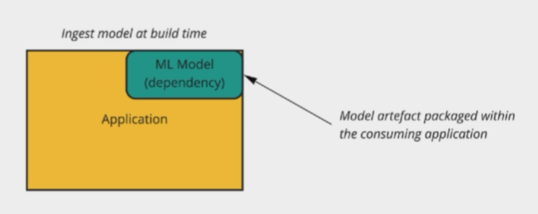
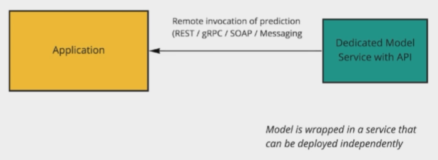
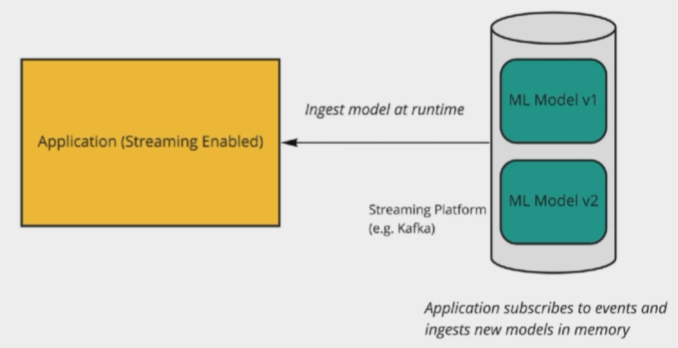
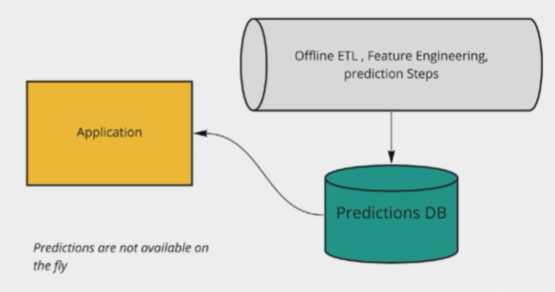
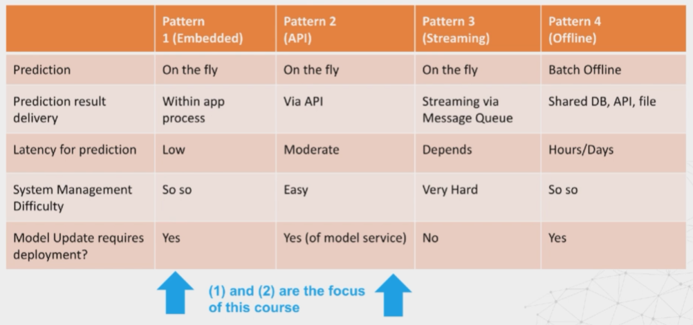
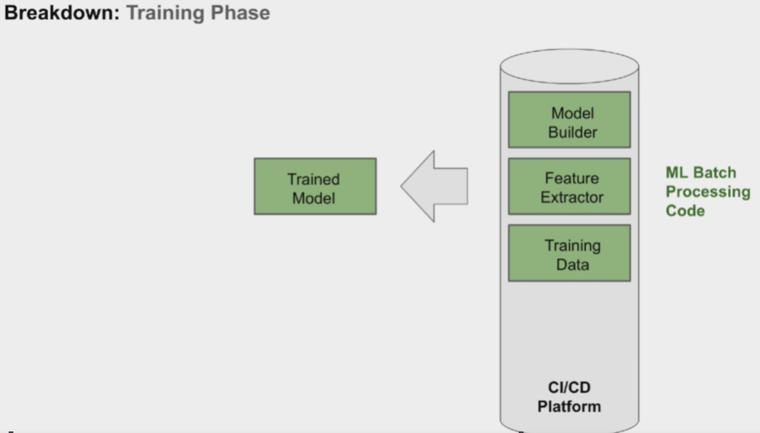
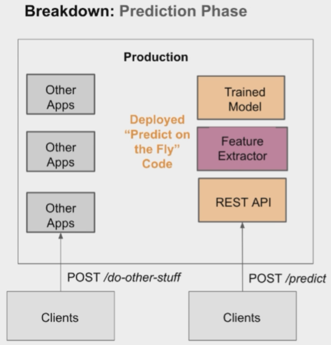
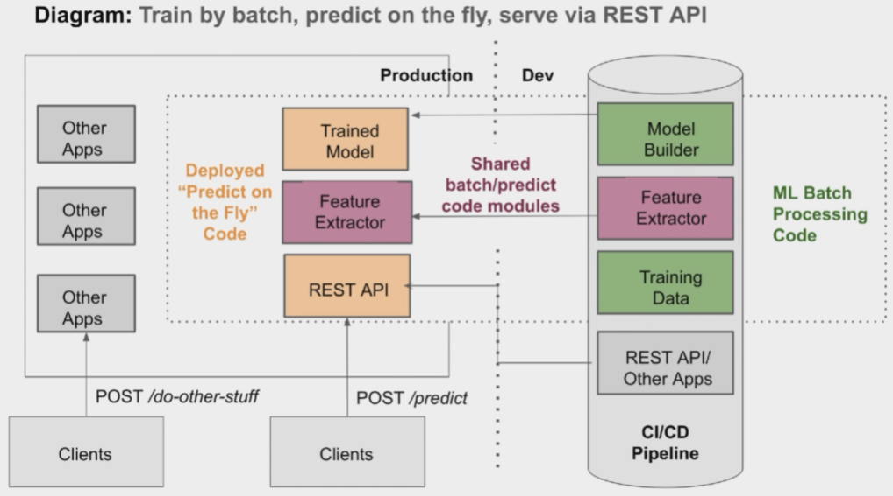
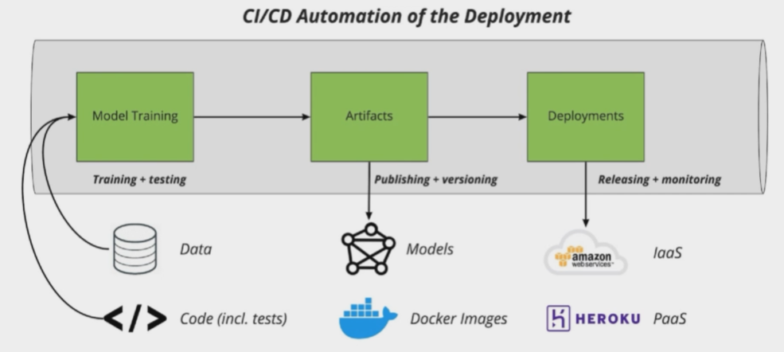

# Machine learning system architecture

## 1.8 Machine learning system architecture and why it matters
- Process of making models available in production environments, where they can provide predictions to other software systems
- Potentially the most challenging stage of the machine learning life cycle

### Systems
- Infrastructure
- Applications
- Data
- Documentation
- Configuration
  
### Architecture
- ISO/IEC 42010 defines architecture as:
    - "fundamental concepts or properties of a system in its environment embodied in its elements, relationships and in the principles of its design and evolution"
    - The way woftware components are arranged and the interactions between them

### Why start with architecture?
- Maintaining ML systems is difficult
- All the challenges of traditional software systems *plus* new challenges for model and data changes

## 1.9 Challenges of ML systems
- The ML component usually only plays a small part in a much larger system:

- Challenges
    - Reproducibility (versioning everywhere)
    - Data dependencies
    - Configuration issues
    - Data preparation/feature engineering
    - Detecting model errors
        - Traditional software tests raise exceptions when errors are found
        - Exceptions won't be thrown by a model that is underperforming
    - ML system contributors
        - A breakdown in communication can lead to a deployment underperforming or failing

- Research vs production environments
    

## 2.0 Key principles for machine learning systems
- ML has only recent started to play an important role for technology companies
- Best practices are still being established

- Principles
    - Automation of all stages of the ML workflow
    - Reproducibility
        - EVERYTHING TO DO WITH THE MACHINE LEARNING SYSTEM IS UNDER VERSION CONTROL
        - Training is reproducible
        - Every model specification has a code review and is checked into a repository
        - Models can be quickly and safely rolled back to a previous serving version
    - Versioning
        - 1.2.3-beta.1+meta major.minor.patch-pre-release+metadata
        - Each model is tagged with a provenance tag that explains which data it has been trained on and which version of the model
        - Each dataset is tagged with information about where it originated from and which version of the code was used to extract it
    - Testing 
        - The full ML pipeline is integration tested
            - Exercising the entire pipeline → changes in one component can cause errors in other components
            - Can train on a sample of data to improve speed
        - All input feature code is tested
            - Unit tests should exist for feature engineering and pre-processing steps
        - Model specification code is unit tested
            - Testing model configuration
        - Model quality is validated before attempting to serve it
            - Sudden degradation & slow degradation
        - Good link on testing:
            - https://www.martinfowler.com/testing/ 
    - Infrastructure
        - Models are tested via a shadow and/or canary process before they enter production serving environment
        - Monitor the model performance
- Good practices compound!

## 2.1 Machine learning system architecture approaches
### ML System Architectures
1. Model embedded in appliation
2. Served via a dedicated service
3. Model published as data (streaming)
4. Batch prediction (offline process)

### Serving ML Models - Formats
- Serialize the model object with pickle
- MLFlow (MLeap module provides a common serialization format for exporting/importing Spark, Scikit-learn and Tensorflow models
- Language-agnostic exchange formats to share models, such as PMML, PFA and ONNX

### Architecture 1: Embedded
Model artefact packaged within the consuming application
- Pre-trained: Yes
- Predict-on-the-fly: Yes
- Variations: Embedded on mobile device (e.g. Core ML), running in the browser (Tensorflow.js)
- Simplciity vs flexibility
    - Simple but not flexible, if we update our model we need to release a new version of our app

    

### Architecture 2: Dedicated model API
Model is wrapped in a service that can be deployed independently
- Pre-trained: Yes
- Predict-on-the-fly: Yes
- Variations: Many. See also Architecture 3
- Simplicity vs flexibility
    - Increased complexity in maintaining another service, but flexibility because our model deployments are separate from our main application deployment

    

### Architecture 3: Model published as data
Application subscribes to events and ingests new models in memory
- Pre-trained: Yes
- Predict-on-the-fly: Yes
- Variations: Different publish/subscribe patterns
    - Increased complexity in infrastructure, however we can seamlessly upgrade our models

    

### Architecture 4: Offline predictions
- Pre-trained: Yes
- Predict-on-the-fly: No
- Variations: Serve, predictions via API, CSV, dashboards
- Outdated architecture

    

There is no "best" architecture, simply a set of trade-offs that best meet system requirements based on time and resource constraints

### Architecture comparison

## 2.2 Machine learning system component breakdown
- High level architecture
    - Data layer: Provides access to all of our data sources 
    - Feature layer: Generating feature data in a transparent, reusable and scalable manner
    - Scoring layer: Transforms features into predictions
    - Evaluation layer: Monitoring production models

- Training phase
    - Three steps grouped into a single pipeline:
    

    - Scikit-Learn and Pandas can be used for simple pipelines
    - Apache spark and Apache Airflow used for more intricate pipelines

- Prediction phase
    

- Training and prediction
    

- Must also consider infrastructure, external services, dependencies and running our continuous integration and deployment pipeline

- Process covered in the course:
    - Application code and data to train our models in an automated fashion
    - Artifacts: Trained models and Docker images, which will enable us to snapshot our application and its dependencies for quick deployment
    - Deploying the ML application in an automated way using both platform as a service and infrastructure as a service, which are both different cloud hosting options

    
